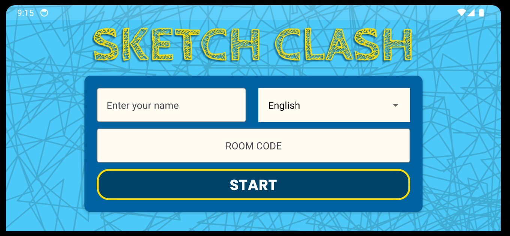
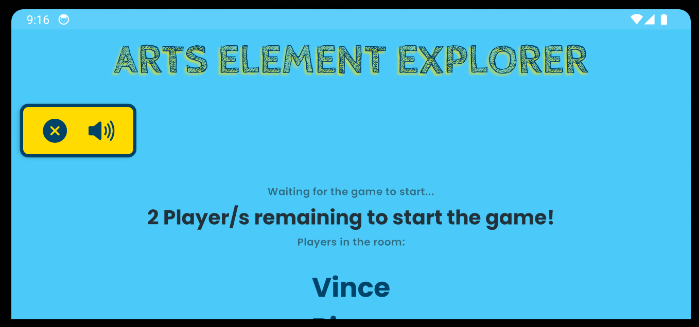
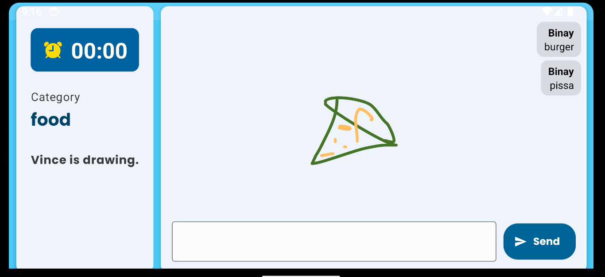

# Arts Elements Explorer

Welcome to Arts Elements Explorer! This project aims to explore various elements of art and provide insights into their significance and usage in different art forms.

## Table of Contents

- [Introduction](#introduction)
- [Installation](#installation)
- [Usage](#usage)
- [Contributing](#contributing)
- [License](#license)
- [Libraries Used](#libraries-used)

## Introduction

Arts Elements Explorer is a comprehensive guide that delves into the fundamental elements of art, such as line, shape, color, texture, and more. By understanding these elements, artists can enhance their creative expression and communicate their ideas effectively.

## Installation

To get started with Arts Elements Explorer, follow these steps:

1. Clone this repository to your local machine.
2. Install the required dependencies by running `npm install` or `yarn install`.
3. Start the Expo development server by running `expo start`.
4. Open the Expo Go app on your mobile device and scan the QR code displayed in the terminal.

## Usage

Once you have installed the project, you can:

- Explore different art elements and their characteristics
- Learn how these elements are utilized in various art forms
- Gain inspiration for your own artistic endeavors

## Contributing

Contributions are welcome! If you have any suggestions, bug reports, or feature requests, please open an issue or submit a pull request.

## License

This project is licensed under the [MIT License](LICENSE).

## Libraries Used

The following libraries are used in this project:

- Firebase
- react-native-reanimated
- eact-native-svg
- react-native-paper

## Sample Images

Here are some sample images that you can find in the `public_assets` folder:

Feel free to use these images to enhance your understanding of the art elements discussed in this project.
